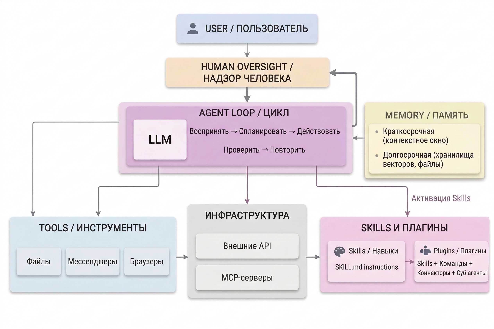

Агентный ИИ — следующий шаг после чатботов: языковые модели, встроенные в цикл автономного действия. Вместо одного ответа на один вопрос агент самостоятельно выполняет задачу целиком: планирует шаги, использует инструменты, взаимодействует с файлами и внешними сервисами.

---

## Экосистема агентного ИИ

{width=2528px height=1684px}

---

## Содержание раздела

-  [Глоссарий](./glossariy) — ключевые термины агентного ИИ: агент, инструменты, скилл, плагин, MCP, мультиагентность. *Начните здесь, если в тексте статей встречаются незнакомые слова*

-  [Что такое агентный ИИ](./chto-takoe-agentskiy-ii) — как устроен агент изнутри, цикл работы, чем отличается от обычного чата

-  [Обзор инструментов](./obzor-servisov/_index) — актуальные агентные сервисы: OpenClaw, Claude Cowork, Perplexity Computer. Юридические кейсы для каждого, отработанные в сообществе

-  [Кастомизация агентов](./kastomizaciya-agentov/_index) — три уровня кастомизации (MCP, скиллы, плагины), сравнение по платформам и Claude-специфика