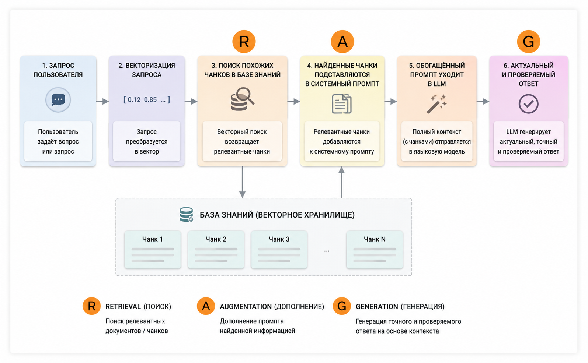

<note type="info">

Как RAG работает внутри: три шага пайплайна, векторный поиск на эмбеддингах, подготовка данных (чанкинг) и ограничения технологии. Незнакомые термины собраны в [Глоссарии](./../glossariy).

</note>

**Дата составления:** 2026-05-28\
**Статус:** 💡 Актуально

---

## Как это устроено: типичный RAG-пайплайн

Аббревиатура RAG прямо описывает три шага работы системы:

-  **R -- Retrieval (поиск):** запрос пользователя ищется в подготовленной базе знаний, оттуда извлекаются релевантные фрагменты текста (чанки);

-  **A -- Augmented (обогащение):** найденные фрагменты подставляются в системный промпт -- он «обогащается» актуальным контекстом;

-  **G -- Generation (генерация):** LLM генерирует ответ уже с учетом этого дополнительного контекста.

Схематично это выглядит так:

{width=1595px height=986px}

Важная деталь: сам поиск (этап R) -- это **просто код**, а не работа нейросети. Близость текстов вычисляется математически. Специальная нейросеть (*эмбеддер*) участвует только в подготовке -- превращении текстов в числа.

---

## Векторный поиск и эмбеддинги

### Что такое эмбеддинг

**Эмбеддинг** (*embedding*) -- это числовое представление текста, то есть его координаты в многомерном пространстве. Со школьной геометрии мы помним вектор на плоскости (2 координаты) или в пространстве (3 координаты). Эмбеддинг -- такой же вектор, только координат у него сильно больше: например, 768, 1024 или 3072 числа.

Превращение текста в эмбеддинг называется **векторизацией**. Благодаря тому, как обучается модель-эмбеддер, векторизация сохраняет семантику (смысл) исходного текста: близкие по смыслу тексты оказываются рядом в пространстве. Если векторизовать юридические термины и бытовые понятия, то «ущерб» и «моральный вред» встанут рядом, а «борщ» и «кошки» окажутся далеко.

### Как ищется похожее: косинусное сходство

Семантическую близость между двумя векторами чаще всего измеряют через **косинусное сходство** -- косинус угла между ними. Получается число (как правило, от 0 до 1): чем оно выше, тем ближе тексты по смыслу. Юридические термины из одного пула образуют острый угол (высокое сходство), а с «рецептом борща» угол близок к 90° -- тексты почти не связаны.

При запросе система векторизует ваш текст тем же эмбеддером, что и базу, и сравнивает его со всеми векторами в базе, возвращая самые близкие чанки.

---

## Подготовка данных: чанкинг

Эмбеддер не может обработать сразу большой текст -- он ограничен контекстным окном. Если текст больше окна, происходит **тихая потеря данных** (модель молча выбрасывает лишнее) или **размытие семантики** (вектор становится «обо всем и ни о чем»). Поэтому документы заранее режут на части -- это называется **чанкинг** (*chunking*). Векторизуется чанк целиком, а не отдельные слова в нем.

Размер чанка -- ключевой параметр: большой чанк сохраняет общий смысл, но «размывает» детали; маленький дает точность, но теряет контекст. Оптимум подбирается экспериментально. Основные стратегии нарезки:

-  **Наивный чанкинг (naive)** -- текст режется на равные части без учета смысла на границах. Для юридических текстов работает плохо: дробление разрывает связи между нормами и судебной практикой;

-  **Чанкинг с перехлестом (overlap)** -- каждый фрагмент включает окончание предыдущего и начало следующего, чтобы не терять контекст на стыках. Лучше наивного, но для права все равно не идеально;

-  **Логический чанкинг (structure-aware)** -- нарезка строго по структуре документа (статьи закона, пункты и разделы договора). Сохраняет целостность смысла, но требует разметки;

-  **Иерархический RAG (parent-child)** -- база из нескольких уровней: поиск идет по одному разделу, а в ответ «паровозиком» подтягиваются связанные. Пример -- статья ГК и комментарии к ней;

-  **RAG на базе резюме (summary-based)** -- векторизуются не тексты целиком, а их резюме по шаблону (например, для договоров: стороны -- предмет -- цена).

---

## Ограничения технологии

-  **Нет «золотого стандарта».** Каждая база требует индивидуальной настройки под тип данных. То, что идеально работает на кратких справках, ломается на больших договорах. RAG -- это не готовый продукт, а процесс долгой подготовки и калибровки;

-  **Недостаточная точность поиска.** Эмбеддинги плохо улавливают смысловую разницу, очевидную человеку: путают отрицания («действителен» и «недействителен» могут оказаться рядом), теряют точные формулировки и цитаты, не различают модальность («должен», «может», «вправе»), игнорируют структуру юридических документов (иерархию норм, кросс-референсы);

-  **Информационный шум.** Попадание нерелевантных чанков в промпт сильно снижает качество ответа;

-  **Проблемы масштабируемости.** Система, отлично работающая на 1 000 документов, может «сломаться» на 10 000: чем больше похожей информации в базе, тем сложнее найти действительно релевантный чанк.

---

## Связанные статьи

-  [Глоссарий](./../glossariy) -- ключевые термины: эмбеддинг, векторизация, чанкинг, косинусное сходство и другие

-  [Готовые решения и проекты с RAG](./gotovye-resheniya) -- какие сервисы и проекты уже используют эту технологию

-  [Контекстное окно](./../../../znakomstvo-s-nejrosetyami/kontekstnoe-okno) -- ограничение, из-за которого тексты приходится резать на чанки

-  [Что такое LLM](./../../../znakomstvo-s-nejrosetyami/chto-takoe-llm) -- как устроена языковая модель, которая генерирует ответ в RAG

## Дополнительные материалы

-  Вебинар «*NotebookLM для юриста: основы RAG*» (15.07.2026): [запись](https://kinescope.io/tQAfjgDFfgYcKooqoVGKb5) · [презентации](https://drive.google.com/file/d/1Q9v-ZVb3adsqhMAXO_77cpRC0DRW0k_H/view) -- Степан Леонтьев об основах технологии RAG и принципах ее работы

-  [Retrieval-Augmented Generation for Knowledge-Intensive NLP Tasks](https://arxiv.org/abs/2005.11401) -- оригинальная статья, в которой термин RAG представили на NeurIPS 2020

-  [Блог «Делай RAG»](https://blog.delay-rag.ru/tag/rag/) -- авторские материалы о RAG-технологии в юридическом домене: от установочных постов до подробных лонгридов для разного уровня подготовленности

---

Теги: #rag #эмбеддинги #управление-данными #актуальное