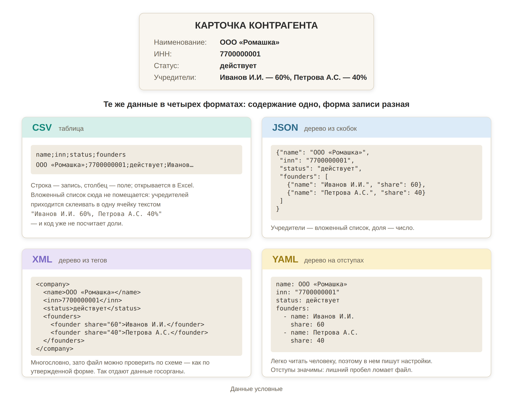
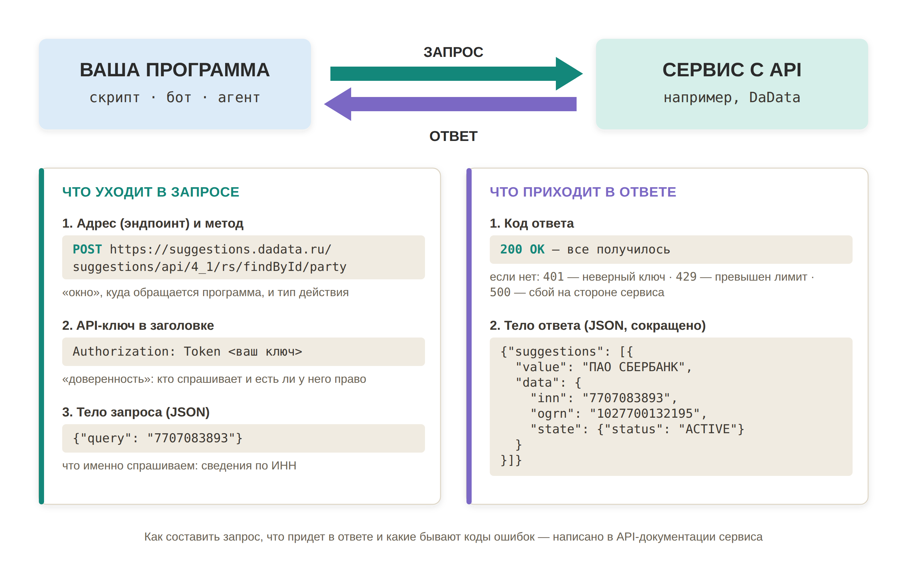

<note type="info">

Как программы записывают и передают данные: что такое форматы данных, почему коду нужна структура и как устроено API. Поможет понимать, что пишет агент, и находить источники данных для юридических программ.

</note>

**Дата составления:** 2026-09-27\
**Статус:** 💡 Актуально

---

## Суть

Нейросеть понимает смысл, а код -- только структуру. LLM прочитает договор и найдет ИНН контрагента, даже если он спрятан в примечании мелким шрифтом. Код так не умеет: он найдет ИНН, только если заранее известно, где именно тот записан. Зато код делает свою работу мгновенно, бесплатно и одинаково тысячу раз подряд.

Поэтому типичная программа юриста устроена так: нейросеть превращает текст в структуру, а дальше работает код. Например, 300 договоров по очереди уходят в нейросеть, она возвращает по каждому одинаковый набор полей -- стороны, сумма, срок, -- а код складывает их в реестр, считает сроки и подсвечивает те, что истекают в этом месяце.

Чтобы такая цепочка работала, данные на каждом ее стыке записывают по строгим правилам. Эти правила и называются **форматами данных**. А когда данные нужно получить из другой программы или сервиса -- из реестра, справочно-правовой системы, нейросети, -- используют **API**: договоренность о том, как одна программа обращается к другой.

---

## Что такое формат данных

**Формат данных** -- договоренность о том, как записать информацию в текстовом файле, чтобы программа прочитала ее без догадок: где начинается и заканчивается запись, как называется каждое поле и где его значение.

Юристу проще всего представить это как разницу между свободным письмом и документом по утвержденной форме. Письмо прочтет человек или нейросеть. Документ по форме можно обрабатывать автоматически: известно, в какой графе стоит ИНН, а в какой -- дата.

Формат задает форму, а не содержание. Одну и ту же карточку контрагента можно записать в разных форматах -- данные от этого не меняются, меняется только способ записи:

{width=2800px height=2180px}

## Где встречаются форматы

Форматы данных нужны не только для обмена с внешними сервисами. Они появляются на каждом этапе жизни программы:

<table header="row">
<colgroup><col width="300"/><col width="488.333334"/></colgroup>
<tr>
<td>

**Где**

</td>
<td>

**Примеры**

</td>
</tr>
<tr>
<td>

На входе -- данные, которые программа получает

</td>
<td>

Выгрузка чата из Telegram в JSON, открытые данные госорганов в XML, ваш реестр договоров в CSV

</td>
</tr>
<tr>
<td>

Внутри программы -- промежуточные результаты

</td>
<td>

Поля, которые нейросеть извлекла из договоров, программа сохраняет в JSON, чтобы не отправлять те же документы повторно

</td>
</tr>
<tr>
<td>

Между программами -- обмен по API

</td>
<td>

Сервис проверки контрагентов отвечает на запрос по ИНН в JSON

</td>
</tr>
<tr>
<td>

В настройках -- конфигурация программ

</td>
<td>

YAML-шапка в начале каждой статьи этой Базы (порядок и заголовок -- на сайте шапка не видна, но видна на GitHub), шапка файла `SKILL.md` у [скиллов](./../../aktualnoye/agentskiy-ii/kastomizaciya-agentov/skills-i-plaginy), свойства заметок в Obsidian, сценарии GitHub Actions

</td>
</tr>
<tr>
<td>

На выходе -- результат для вас

</td>
<td>

Таблица в CSV или Excel, отчет

</td>
</tr>
</table>

## Три формы структуры

За всеми форматами стоят три способа организовать данные. От формы зависит, какой формат подойдет под задачу:

-  **Таблица.** Все записи состоят из одинакового набора полей, как строки реестра. Просто и наглядно, открывается в Excel. Но вложенность таблица не выдерживает: если у компании пять учредителей, их придется склеивать в одну ячейку текстом. Так устроен CSV.

-  **Дерево.** Запись может содержать вложенные записи: компания -- учредители -- доли каждого. Так устроены JSON, XML и YAML, а также почти все ответы API и выгрузки госорганов.

-  **Список «ключ = значение».** Плоский перечень настроек без вложенности: `ИМЯ=значение` на каждой строке. Так устроен файл `.env`.

## Основные форматы

### JSON

Главный формат обмена данными между программами. Запись заключается в фигурные скобки, поля -- пары «название: значение», списки -- в квадратных скобках. Различает типы значений: текст в кавычках, число без кавычек, «да/нет» (`true`/`false`).

**Где встретите:** в ответах почти любого API, в выгрузках (например, Telegram выгружает историю чата в JSON), в промежуточных файлах ваших программ, в настройках агентов и MCP-серверов (`claude_desktop_config.json`).

**Структурированный вывод** (Structured Output). Нейросеть можно попросить вернуть ответ не текстом, а строго в JSON по заданному набору полей. Это и есть тот самый стык «нейросеть -- код»: свободный текст код разобрать не сможет, а JSON с полями «стороны», «сумма», «срок» -- сможет. Современные API нейросетей умеют гарантировать, что ответ будет валидным JSON.

**На чем спотыкаются:** синтаксис строгий. Лишняя запятая или незакрытая скобка -- и файл не читается целиком.

### CSV

Таблица в текстовом файле: одна строка -- одна запись, значения разделены запятой или точкой с запятой, первая строка обычно содержит названия столбцов. Самый простой способ передать таблицу между программой и Excel.

**Где встретите:** реестры договоров, дел, контрагентов; выгрузки из учетных систем; результаты ваших скриптов.

**На чем спотыкаются:**

-  **Кодировка.** Файл, сохраненный программой, открывается в Excel «кракозябрами». Причина -- расхождение кодировок: программы обычно пишут в UTF-8, а Excel может ждать Windows-1251. Решение -- открывать файл через «Данные -> Из текстового/CSV-файла» или попросить нейросеть сохранять CSV в кодировке «UTF-8 with BOM».

-  **Разделитель.** Русский Excel ждет точку с запятой, а многие программы ставят запятую -- и вся строка попадает в один столбец.

-  **Все значения -- текст.** CSV не хранит типы и формулы. Excel при открытии сам угадывает, где число, и ошибается ровно на юридических данных: теряет ведущий ноль у ИНН, превращает 20-значный номер расчетного счета в `4,07028E+19` с потерей последних цифр. Такие поля надо явно импортировать как текст.

### XML

Дерево из тегов: каждое значение обрамлено открывающим и закрывающим тегом (`<inn>7700000001</inn>`). Формат многословный, зато у XML-файла может быть **схема** -- формальное описание того, какие поля обязательны и что в них допустимо. Файл проверяется по схеме автоматически, как документ по утвержденной форме.

**Где встретите:** это основной формат государственных информационных систем. В XML идут электронные УПД по формату ФНС, налоговая и кадровая отчетность, открытые данные ФНС, ответы сервисов ЦБ и ЕИС в сфере закупок.

**На чем спотыкаются:** объем. Нейросеть тратит на теги много токенов, а пачку XML-выгрузок в контекстное окно не уместить. Правильный путь -- попросить нейросеть написать скрипт, который перегонит XML в таблицу, а не отдавать сами файлы в чат.

### YAML

Дерево на отступах: вложенность обозначается не скобками, а сдвигом строки вправо. Поэтому YAML легче всего читать человеку, и в нем чаще всего пишут настройки.

**Где встретите:** в шапках Markdown-файлов (так устроены статьи этой Базы, файлы `SKILL.md`, свойства заметок в Obsidian), в сценариях автоматизации GitHub Actions (см. [Сборка и деплой](./sborka-i-deploy)), в конфигурациях многих программ.

**На чем спотыкаются:** отступы значимы. Лишний пробел или табуляция вместо пробелов меняют смысл или ломают файл, а на глаз ошибку не видно.

Отдельно стоит Markdown: это тоже текстовый формат, но для документов, а не для данных. О нем -- в статье [Хранение знаний](./../../aktualnoye/upravlenie-dannymi-i-pamyatyu/hranenie-znaniy).

### Какой формат просить на выходе

Формат результата выбирают по тому, кто будет с ним работать дальше:

-  CSV нужен, когда таблицу загрузят в другую систему, которая принимает именно его.

-  Если результат уйдет в другую программу или на следующий шаг цепочки -- JSON: он сохраняет вложенность и типы значений.

-  Сводку или отчет для чтения удобно получать в Markdown.

Если сомневаетесь, просите два файла сразу: JSON для программы и Markdown для себя -- агенту это почти ничего не стоит.

## Почему что-то не попадет в результат

Код берет только то, что может распознать однозначно. Все, что записано «не по форме», программа пропустит или исказит -- причем часто молча. Типичные причины:

-  **Кодировка** -- кириллица превращается в «кракозябры» при переходе между программами;

-  **Даты** -- в одном файле встречаются `25.09.2026`, `2026-09-25` и «25 сентября 2026 г.»;

-  **Числа** -- суммы с запятой и с точкой, с пробелами между разрядами, с «руб.» в той же ячейке;

-  **Объединенные ячейки и «шапки» в несколько строк** в таблицах Excel;

-  **Поле не на своем месте** -- ИНН в столбце «Примечание», два телефона в одной ячейке;

-  **Скан вместо текста** -- в отсканированном документе нет текста, пока его не распознают (OCR).

Будьте готовы к тому, что часть записей не попадет в результат, и планируйте проверку заранее.

<note type="quote">

Добавь в программу журнал пропусков: если запись не удалось обработать или какое-то поле распознано неуверенно, не пропускай ее молча, а выводи в отдельный файл с указанием причины. В конце работы покажи, сколько записей было на входе, сколько обработано и сколько попало в журнал.

</note>

---

## Служебные файлы: `.env` и `.sh`

Рядом с данными в проекте встречаются файлы, которые форматами данных не являются, но их важно узнавать.

`.env` -- файл с настройками программы в виде «ключ = значение» (`DADATA_API_KEY=...`). Важен не формат, а содержимое: здесь лежат секреты -- API-ключи, пароли, адреса баз данных. Такой файл никогда не должен попасть в публичный репозиторий. Подробнее -- [Безопасность](./bezopasnost).

`.sh` -- вообще не данные, а код: сценарий команд для терминала (shell script). Встречается в проектах как `install.sh`, `start.sh`, `deploy.sh` -- запуск одной командой того, что иначе пришлось бы вводить построчно. На Windows аналоги -- файлы `.bat` и `.ps1`. Правило одно: не запускайте сценарий, пока нейросеть не объяснила построчно, что он делает. Особенно это касается команд вида «скачай сценарий из интернета и сразу выполни» -- так на компьютер попадает чужой код, который никто не проверял.

---

## API

**API** (Application Programming Interface) -- это договоренность о том, как одна программа обращается к другой: куда отправить запрос, в каком виде и что придет в ответ.

### Зачем юристу

Через API программа получает данные напрямую из первоисточника, без вас и без браузера. Это дает три вещи:

-  **Проверяемые данные вместо пересказа.** Статус компании берется из реестра, а не из памяти нейросети, которая может его выдумать (см. [Ограничения технологии и галлюцинации](./../../znakomstvo-s-nejrosetyami/gallyutsinatsii)).

-  **Массовая обработка.** 300 договоров в чат не загрузить, а скрипт отправит их в нейросеть по одному и соберет ответы в таблицу.

-  **Автоматические цепочки.** Пришло письмо -- нейросеть выделила из него сроки -- в Telegram пришла задача. Каждое звено -- отдельный сервис, и API позволяет им передавать данные друг другу без вашего участия.

Источники данных, которые пригодятся юристу:

<table header="row">
<colgroup><col width="197.083334"/><col width="197.083334"/><col width="197.083334"/><col width="197.083334"/></colgroup>
<tr>
<td>

**Группа**

</td>
<td>

**Сервис**

</td>
<td>

**Что дает юристу**

</td>
<td>

**Доступ**

</td>
</tr>
<tr>
<td>

Госорганы

</td>
<td>

Банк России

</td>
<td>

Ключевая ставка (расчет процентов по ст. 395 ГК РФ), курсы валют

</td>
<td>

Бесплатно, ответы в XML

</td>
</tr>
<tr>
<td>

</td>
<td>

ЕИС в сфере закупок

</td>
<td>

Закупки и контракты по 44-ФЗ и 223-ФЗ

</td>
<td>

Бесплатно, токен через Госуслуги, ответы в XML

</td>
</tr>
<tr>
<td>

</td>
<td>

ФНС

</td>
<td>

Реестр МСП и другие наборы открытых данных

</td>
<td>

Бесплатно, архивами в XML; точечного API «выписка по ИНН» нет

</td>
</tr>
<tr>
<td>

</td>
<td>

Арбитражные суды (КАД)

</td>
<td>

--

</td>
<td>

Официального API нет, сайт защищается от автоматического сбора данных

</td>
</tr>
<tr>
<td>

Справочно-правовые системы

</td>
<td>

Гарант Коннект

</td>
<td>

Поиск документов, редакции, проверка актуальности, подключение к ИИ через MCP

</td>
<td>

Платно

</td>
</tr>
<tr>
<td>

</td>
<td>

КонсультантПлюс

</td>
<td>

Интеграция в CRM, ERP и корпоративные порталы для поиска правовой информации

</td>
<td>

Открытого API с самостоятельным подключением нет; корпоративная интеграция по договору через поставщика системы

</td>
</tr>
<tr>
<td>

Агрегаторы данных о компаниях

</td>
<td>

DaData

</td>
<td>

Реквизиты и статус организации по ИНН

</td>
<td>

До 10 тыс. запросов в день бесплатно (лимит может измениться после составления этой статьи)

</td>
</tr>
<tr>
<td>

</td>
<td>

Checko, Контур.Фокус, СПАРК

</td>
<td>

Проверка контрагентов: суды, финансы, исполнительные производства

</td>
<td>

Платные тарифы или небольшие бесплатные лимиты

</td>
</tr>
<tr>
<td>

Нейросети

</td>
<td>

OpenAI, Anthropic, Google, GigaChat

</td>
<td>

Обработка текста внутри вашей программы; российские модели -- для задач, где важна локализация данных

</td>
<td>

Оплата за объем обработанного текста (токены)

</td>
</tr>
</table>

### Как устроены запрос и ответ

Обращение к API всегда состоит из двух частей: программа отправляет **запрос** и получает **ответ**. На схеме -- пример запроса к DaData за сведениями об организации по ИНН:

{width=2800px height=1760px}

**В запросе:**

-  **Эндпоинт** (endpoint) -- адрес, по которому программа обращается к сервису. У одного сервиса обычно много эндпоинтов: один ищет организацию по ИНН, другой -- по названию, третий -- проверяет адрес.

-  **Метод** -- тип действия. Чаще всего встретите `GET` (получить данные) и `POST` (отправить данные для обработки).

-  **API-ключ** -- обычно в заголовке запроса. Подтверждает, кто обращается и есть ли у него право.

-  **Тело запроса** -- что именно спрашиваем, как правило в JSON.

**В ответе:**

-  **Код ответа** -- число, по которому программа понимает результат. `200` -- все получилось. Самые частые ошибки: `401` -- неверный ключ, `429` -- превышен лимит запросов, `500` -- сбой на стороне сервиса. Из России часто встречается и `403` -- доступ запрещен, в том числе по региону. Коды разные у разных провайдеров: например, DaData при исчерпании дневного лимита отвечает `403`. Точное значение смотрите в документации сервиса.

-  **Тело ответа** -- сами данные, как правило в JSON.

### API-документация

У каждого сервиса, который предоставляет API, есть **API-документация** -- его «регламент»: какие есть эндпоинты, как составить запрос, что придет в ответе, что означают коды ошибок.

**Читать ее целиком самому не нужно.** Дайте нейросети, с которой пишете программу, ссылку на документацию или сохраните ее в папку проекта -- агент изучит ее сам и напишет запрос по правилам сервиса. Это надежнее, чем полагаться на память модели: API меняются, и нейросеть может помнить устаревшую версию.

Самим стоит посмотреть четыре вещи:

-  Как получить ключ;

-  Сколько стоит доступ;

-  Какие лимиты на число запросов;

-  На каких условиях можно использовать полученные данные.

### Ключи, лимиты и деньги

**Ключ -- это доверенность.** Кто получил ваш ключ, тот делает запросы от вашего имени и за ваш счет. Поэтому ключ хранится только в `.env`, а не в коде (см. [Безопасность](./bezopasnost)).

**Лимиты.** Почти у любого API есть ограничение на число запросов в минуту или в день. Превысили -- получите ошибку `429`. Если программа обрабатывает большой массив, попросите нейросеть добавить паузы между запросами и повтор после ошибки.

**Деньги.** Схемы оплаты разные. Нейросети берут плату за объем обработанного текста (токены) -- это не то же самое, что подписка на чат. Агрегаторы и справочно-правовые системы продают тарифы или пакеты запросов. Государственные сервисы чаще бесплатны, но требуют регистрации и ограничивают число запросов.

**Получить ключ бывает сложнее, чем написать программу.** Пример -- Telegram. У него два разных API. Бот, созданный через @BotFather, получает токен за минуту, но видит только сообщения, которые прислали ему самому. Чтобы программа читала ваши собственные чаты и каналы -- например, сама выгружала файлы из рабочей папки чатов, -- нужны ключи `api_id` и `api_hash` с сайта [my.telegram.org](https://my.telegram.org). С российским номером получить их непросто: сайт сверяет страну IP-адреса со страной номера и работает нестабильно, так что попытки могут растянуться на часы. Пошаговую [рабочую инструкцию](https://t.me/neiidealnyi_urist/279) опубликовала выпускница курса [«Нейросети для юриста: от основ к системе»](https://runetlex-academy.ru/neuralnetworks) Эльвина Исхакова.

### Вебхук и MCP

**Вебхук** (webhook) -- «API наоборот». Обычно ваша программа сама обращается к сервису. При вебхуке сервис сам присылает вашей программе уведомление, когда что-то произошло: клиент заполнил форму, пришла оплата, в Telegram-бот написали сообщение. Для приема вебхуков нужен бэкенд с адресом в интернете (см. [Фронтенд и бэкенд](./frontend-backend)).

**MCP** (Model Context Protocol) -- по сути API, упакованное для агента. MCP-сервер описывает агенту, какие действия доступны у сервиса, а обращается к сервису он все равно через API. Подробнее -- [MCP-серверы](./../../aktualnoye/agentskiy-ii/kastomizaciya-agentov/mcp).

### Когда API нет

Если у сайта нет API, остается браузерная автоматизация: программа открывает браузер и «кликает» за человека. Это работает, но хрупко:

-  Сайт меняет верстку -- программа ломается;

-  Сайты ограничивают частоту обращений и включают капчу, если заподозрят автоматический сбор;

-  Есть юридическая сторона: условия использования сайта могут запрещать автоматический сбор, а собранные данные могут оказаться персональными.

Если официальный API есть -- используйте его, даже если он платный.

---

## Что учесть

-  **Ключи -- только в** `.env`**.** Ключ в коде рано или поздно окажется в чужих руках.

-  **«Готово» не значит «ничего не потерялось».** Сравнивайте число записей на входе и на выходе и сверяйте несколько записей с исходником.

-  **Большие файлы -- скрипту, а не в чат.** XML-выгрузки и таблицы на десятки тысяч строк нейросеть должна обрабатывать кодом, а не читать сама.

<note type="info">

**Что меняется с агентом**

-  **Берет на себя агент:** читает API-документацию, пишет запросы, разбирает ответы и перегоняет данные из формата в формат.

-  **Остается за вами:** выбор источника данных, проверка условий его использования, хранение ключей.

-  **О чем не забыть:** агент сообщит об успехе, даже если часть записей не распознал. Просите журнал пропусков и проверяйте итоговые цифры.

Подробнее -- [Кодинг с агентами](./koding-s-agentami)

</note>

---

## Связанные статьи

-  [Глоссарий](./glossariy) -- API, эндпоинт, формат данных, API-ключ, вебхук, `.env`

-  [Фронтенд и бэкенд](./frontend-backend) -- где в программе происходят обращения к API и зачем для них бэкенд

-  [Безопасность](./bezopasnost) -- как хранить ключи и не выложить `.env` в открытый доступ

-  [MCP-серверы](./../../aktualnoye/agentskiy-ii/kastomizaciya-agentov/mcp) -- как агент подключается к внешним сервисам

-  [Ограничения технологии и галлюцинации](./../../znakomstvo-s-nejrosetyami/gallyutsinatsii) -- почему данные из первоисточника надежнее ответа модели

-  [Кодинг с агентами](./koding-s-agentami) -- как агент сам пишет и запускает программу

## Дополнительные материалы

-  [Правильное открытие CSV-файлов UTF-8 в Excel](https://support.microsoft.com/ru-ru/excel/opening-csv-utf-8-files-correctly-in-excel) -- инструкция Microsoft

-  [API DaData: организация по ИНН или ОГРН](https://dadata.ru/api/find-party/) -- пример API-документации, по которому построена схема в статье

-  [Веб-сервис Банка России для получения ежедневных данных](https://www.cbr.ru/development/dws/) -- ключевая ставка и курсы валют

-  [Инструкция по получению API Telegram](https://t.me/neiidealnyi_urist/279) -- Эльвина Исхакова, канал «неИИдеальный юрист»: пошагово, как получить `api_id` и `api_hash` с российским номером (для Windows)

---

Теги: #концепция #новичок #вайб-кодинг