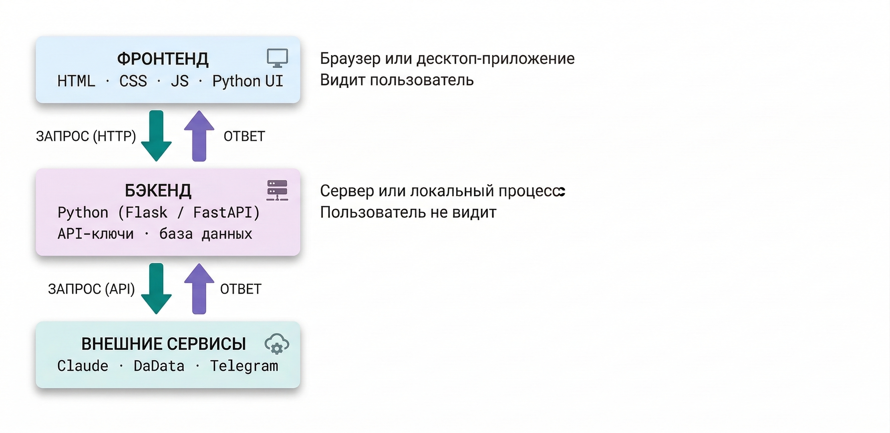

<note type="info">

Два базовых понятия, описывающих «анатомию» программ: где выполняется код и что он делает. Поможет выбрать правильный подход под задачу.

</note>

**Дата составления:** 2026-07-27\
**Статус:** 💡 Актуально

---

## Суть

Фронтенд и бэкенд -- это два основных функциональных «слоя» программы, которые могут присутствовать по отдельности или вместе.

**Фронтенд** -- код, отвечающий за взаимодействие с пользователем: интерфейс, кнопки, формы, отображение данных. В веб-приложениях это, как правило, HTML, CSS и JavaScript. В десктопных приложениях фронтендом тоже называют интерфейсную часть, но она строится на других технологиях.

**Бэкенд** -- код, работающий на сервере или локально без интерфейса. Обрабатывает входящие данные, обращается к базам данных, внешним сервисам (например, нейросетям), выполняет бизнес-логику. Пользователь не видит бэкенд -- только результаты его работы.

---

## Три типа программ

**Только фронтенд** -- когда вся логика выполняется на стороне пользователя. Типичный пример: HTML-файл с калькулятором, который открывается в браузере без сервера.

**Только бэкенд** -- когда интерфейс не нужен: скрипт обрабатывает файлы по расписанию, принимает вебхуки от внешних сервисов, запускается через терминал.

**Фронтенд + бэкенд** -- когда нужен и интерфейс, и серверная логика. Пользователь видит форму (фронтенд), нажимает кнопку, запрос уходит на сервер (бэкенд), бэкенд вызывает API нейросети и возвращает ответ.

{width=2956px height=1440px}

---

## Когда достаточно только фронтенда

Чисто фронтендовое решение подходит, если вся обработка данных может происходить прямо на устройстве пользователя:

-  Конвертеры, калькуляторы, чек-листы;

-  Формы, которые не сохраняют данные;

-  Визуализация загруженных данных прямо в браузере;

-  Генераторы документов по шаблону.

Форматы чисто фронтендового приложения:

-  Один `.html`\-файл -- простейший случай, открывается в браузере без установки;

-  Набор файлов `.html` + `.css` + `.js`, хостящийся как статический сайт (например, на GitHub Pages).

Главный плюс -- не нужен сервер и деплой. Файл можно переслать коллеге в мессенджере.

---

## Когда нужен бэкенд

<table header="row">
<colgroup><col width="300"/><col width="488.333334"/></colgroup>
<tr>
<td>

**Задача**

</td>
<td>

**Почему нужен бэкенд**

</td>
</tr>
<tr>
<td>

Обращение к API нейросетей и других сервисов

</td>
<td>

API-ключ нельзя хранить на клиенте -- он будет виден в коде

</td>
</tr>
<tr>
<td>

Сохранение данных между сессиями

</td>
<td>

Нужна база данных или файловое хранилище на сервере

</td>
</tr>
<tr>
<td>

Загрузка и обработка тяжелых файлов

</td>
<td>

Парсинг PDF, OCR -- ресурсоемко для браузера

</td>
</tr>
<tr>
<td>

Прием вебхуков

</td>
<td>

Нужен адрес в Интернете, на который внешний сервис отправит данные

</td>
</tr>
<tr>
<td>

Автоматические задачи по расписанию

</td>
<td>

Браузер не запускает код без открытой вкладки

</td>
</tr>
</table>

---

## Быстрый интерфейс к бэкенду: Streamlit

Часто у вас есть рабочий скрипт (бэкенд), но хочется приделать к нему простой интерфейс -- чтобы пользоваться было удобнее и можно было отдать коллеге. Верстать фронтенд с нуля ради этого не обязательно: есть **Streamlit** -- библиотека Python, которая дает интерфейс «из коробки». Вы не продумываете, где какая кнопка: в Streamlit уже есть поля ввода, выпадающие списки, вкладки, загрузка файлов, превью документов.

<note type="tip">

Достаточно сказать нейросети, что хотите программу с интерфейсом на Streamlit.

</note>

Запустить такую программу можно локально (на своем компьютере в роли сервера -- `localhost`) или задеплоить как полноценное веб-приложение (см. [Сборка и деплой](./sborka-i-deploy)).

Учтите: задеплоенное Streamlit-приложение по умолчанию открыто всем, у кого есть ссылка, -- любой сможет загрузить в него свои файлы. Если внутри конфиденциальные данные или ваш платный API-ключ, добавьте авторизацию или оставьте программу локальной.

---

## Когда достаточно только бэкенда

Не каждой задаче нужен интерфейс. Примеры, где бэкенд работает без фронтенда:

-  **CLI-скрипт** -- программа, которую пользователь запускает вручную текстовой командой. Например: юрист вводит команду, указывая папку с договорами, и получает таблицу с извлеченными датами и суммами.

-  **Обработчик файлов** -- программа, которая работает в фоне и реагирует на появление новых файлов. Например: сотрудники складывают сканы актов в общую папку, а программа автоматически распознает текст и сохраняет результат в таблицу.

-  **Cron-задача** -- программа, которая запускается автоматически по расписанию. Например: каждое утро в 9:00 скрипт выгружает из базы просроченные задачи и отправляет сводку в Telegram-чат команды.

-  **Вебхук-обработчик** -- программа, которая срабатывает, когда другой сервис присылает ей уведомление. Например: клиент заполняет форму на сайте, и данные автоматически попадают в CRM.

Make, n8n и Zapier -- это фактически бэкенд без кода: они хранят ключи в настройках интеграций и запускаются по триггерам (событиям-условиям: пришло письмо, наступило время, обновилась строка в таблице). Make и Zapier работают только на серверах платформы, а n8n можно развернуть на своем сервере -- тогда данные не покидают вашу инфраструктуру.

---

## Что учесть

-  **API-ключ на фронтенде** -- грубая ошибка безопасности. JavaScript-код фронтенда виден любому пользователю через инструменты разработчика браузера. Ключ должен быть только на бэкенде или в переменных окружения.

-  **«Статический» фронтенд ≠ «простой»**: фронтенд может состоять из сотен файлов. Простота определяется задачей, а не технологией.

-  **Граница фронтенд/бэкенд в десктопных приложениях** несколько другая: в `.exe`, собранном через PyInstaller, весь код -- и интерфейс, и логика -- выполняется локально.

<note type="info">

**Что меняется с агентом**

-  **Берет на себя агент:** сам предложит и соберет подходящую конфигурацию.

-  **Остается за вами:** решение, нужен ли бэкенд вообще -- от этого зависит, куда уйдут данные.

-  **О чем не забыть:** чисто фронтендовое решение остается единственным, где обрабатываемый документ не покидает компьютер.

Подробнее -- [Кодинг с агентами](./koding-s-agentami)

</note>

---

## Связанные статьи

-  [Инструменты](./instrumenty) -- пять способов вайб-кодинга

-  [Кодинг с агентами](./koding-s-agentami) -- как агент сам собирает многофайловую программу

-  [Безопасность](./bezopasnost) -- как защитить секреты и не навредить данным клиентов

-  [Глоссарий](./glossariy) -- API, вебхук, фронтенд, бэкенд, Streamlit

## Дополнительные материалы

-  Бесплатный курс от Stepik для начинающих [HTML на практике](https://stepik.org/course/223383/promo)

-  [Справочник элементов HTML](https://webref.ru/html)

---

Теги: #концепция #новичок #вайб-кодинг