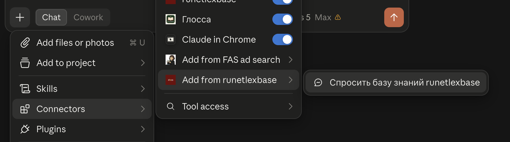

<note type="info">

У Базы есть коннектор: он встраивает ее поиск прямо в вашего ИИ-ассистента -- Claude, ChatGPT, Codex, Cursor, агента-ассистента. Вы задаете вопрос как обычно, ассистент сам ищет ответ в Базе и отвечает со ссылкой на статью. Бесплатно, без регистрации и ключей.

</note>

**Дата составления:** 2026-09-16\
**Статус:** 💡 Актуально

---

## Что это и зачем

Обычно Базу читают на портале: открыли раздел, нашли статью, прочитали. Коннектор дает к ней доступ **изнутри вашего ассистента** -- в том же диалоге, где вы и так работаете.

Технически это MCP-сервер: [MCP](./../aktualnoye/agentskiy-ii/kastomizaciya-agentov/mcp) (Model Context Protocol) -- открытый стандарт подключения агентов к внешним системам. Один и тот же адрес работает в любом MCP-совместимом клиенте, и список таких клиентов постоянно растет.

Смысл не в том, чтобы заменить чтение портала. Смысл в том, чтобы ответы вашего ассистента про нейросети перестали быть его домыслами и стали проверяемыми: вместо общих рассуждений он отдает вам фрагмент конкретной статьи и ссылку на нее. Это тот же прием, что лежит в основе [RAG](./../aktualnoye/upravlenie-dannymi-i-pamyatyu/rag/_index) -- ответ строится по найденному тексту, а не по памяти модели.

---

## Что коннектор умеет

После подключения у ассистента появляются **два инструмента** -- он сам решает, когда их позвать.

<table header="row">
<colgroup><col width="300"/><col width="488.333334"/></colgroup>
<tr>
<td>

**Инструмент**

</td>
<td>

**Что делает**

</td>
</tr>
<tr>
<td>

`search`

</td>
<td>

Ищет по смыслу (не по совпадению слов) и возвращает подходящие фрагменты статей со ссылками

</td>
</tr>
<tr>
<td>

`fetch`

</td>
<td>

Отдает статью целиком, когда фрагментов не хватило

</td>
</tr>
</table>

Плюс **одна слеш-команда** -- на случай, когда хочется позвать Базу вручную.

<table header="row">
<colgroup><col width="300"/><col width="488.333334"/></colgroup>
<tr>
<td>

**Команда**

</td>
<td>

**Когда использовать**

</td>
</tr>
<tr>
<td>

`/runetlexbase <вопрос>`

</td>
<td>

Когда нужно жестко потребовать: отвечай строго по Базе, со ссылкой, и честно скажи, если ответа в ней нет

</td>
</tr>
</table>

Слеш-команда -- это заготовленный шаблон сообщения: она просит агента ответить только по найденному, обязательно дать ссылку и честно сказать, если ответа в Базе нет.

**В Claude (в браузере и в приложении) команда открывает отдельное окно.** Нажмите на плюс в левом нижнем углу окна чата, выберите меню с коннекторами вариант **Add from runetelexbase** (или как вы назовете ваш коннектор).

{width=1614px height=450px}

После нажатия на кнопку «Спросить базу знаний runetlexbase» появится окно **Enter prompt inputs** с полем `question`. Впишите туда вопрос и нажмите кнопку: в чат уйдет шаблон вместе с вашим вопросом. Это штатное поведение Claude для команд от коннекторов. В Claude коннекторы не вызываются слеш-командами.

На обычный вопрос про нейросети ассистент сходит в Базу сам -- так и задумано. Команда пригодится, когда ответ пойдет дальше в работу и домыслы недопустимы.

<note type="info">

Ваш ассистент может не распознать, что вы хотите задать вопрос именно по Базе. Вы можете указать в промпте формулировки по типу «Что сказано в Базе знаний для юристов / в базе Рунетлекса» или иные подобные.

</note>

Наружу из вашего диалога уходит только поисковый запрос, который сформулировал агент. Авторизации нет, аккаунта нет, историю ваших вопросов коннектор не хранит.

---

## Адрес коннектора

```
https://runetlexbase.ru/mcp/
```

Это **единственное**, что нужно ввести в настройках любого MCP-совместимого клиента. Ключей и логинов не требуется, поле авторизации везде оставляйте пустым.

Индекс пересобирается автоматически при каждом обновлении Базы -- отдельно следить за актуальностью не нужно.

---

## Как подключить

<note type="info">

Интерфейсы Claude, ChatGPT, Cursor и остальных меняются часто, и инструкция за ними не всегда успевает. Если пункты у вас называются иначе или что-то не работает -- сверьтесь с актуальной справкой своего сервиса или спросите в чате [сообщества Нейросети | ilovedocs](https://t.me/docsllm).

</note>

### Claude: веб, десктоп и Cowork

Подключение делается один раз, привязывается к аккаунту Claude и появляется во всех клиентах на всех устройствах -- в браузере, в приложении Claude Desktop и в [Claude Cowork](./../aktualnoye/agentskiy-ii/obzor-servisov/claude-cowork).

**Шаг 1.** Откройте Claude и в боковой панели выберите **Customize**.

**Шаг 2.** Перейдите в раздел **Connectors** и нажмите **«+»** -> **Add custom connector**.

**Шаг 3.** Заполните два поля:

-  **Name** -- `runetlexbase` (название видите только вы);

-  **URL** -- `https://runetlexbase.ru/mcp/`.

**Шаг 4.** Блок **Advanced settings** с полями OAuth не трогайте: коннектор работает без авторизации.

**Шаг 5.** Нажмите **Connect**. В списке появится строка со статусом **Connected**.

**Шаг 6.** Откройте новый чат и спросите что-нибудь по теме -- например, «чем Perplexity лучше NotebookLM для юриста?». Claude сам поймет, что нужен коннектор.

<note type="info">

Пользовательские коннекторы доступны на всех планах, включая Free, но на Free можно подключить только один. В корпоративных аккаунтах (Team, Enterprise) коннектор сначала добавляет владелец в **Organization settings -> Connectors**, и только после этого он появляется у остальных.

</note>

### Claude Code

Одна команда в терминале:

```bash
claude mcp add --transport http runetlexbase https://runetlexbase.ru/mcp/
```

Проверить -- `claude mcp list`: у подключенного сервера будет статус **Connected**. Внутри сессии то же самое показывает команда `/mcp`.

По умолчанию коннектор виден только в текущем проекте. Флаг `--scope user` делает его доступным во всех ваших проектах:

```bash
claude mcp add --transport http runetlexbase https://runetlexbase.ru/mcp/ --scope user
```

### ChatGPT

<note type="info">

Коннектор добавляется и в браузере на `chatgpt.com`, и в десктопном приложении. Нужен платный план -- Plus, Pro, Team, Enterprise или Edu; на Free пользовательские коннекторы недоступны.

</note>

#### Для браузерной версии:

**Шаг 1.** Откройте ChatGPT -- в браузере на `chatgpt.com` или в приложении -- и нажмите на аватар -> **Settings**.

**Шаг 2.** В разделе **Security and login** включите **Developer mode**. Без него кнопка добавления не появится.

**Шаг 3.** Откройте в боковой панели раздел **Plugins** и нажмите **«+»**.

**Шаг 4.** Заполните поля: имя (`runetlexbase`), описание, **URL** `https://runetlexbase.ru/mcp/`, авторизация -- **без нее** (No authentication).

**Шаг 5.** Сохраните и откройте новый чат.

#### Для десктопной версии:

Здесь порядок другой: коннектор добавляется не как плагин, а как MCP-сервер.

**Шаг 1.** Откройте меню **Plugins** (Плагины), перейдите на вкладку **MCPs**, справа сверху нажмите **Add** -> **Add MCP server**.

**Шаг 2.** В форме **Connect to a custom MCP** заполните:

-  **Name** -- любое название, например `fas-ad`;

-  **Type** -- переключите на **Streamable HTTP**. По умолчанию выбран **STDIO**, с ним коннектор не заработает;

-  **URL** -- `https://runetlexbase.ru/mcp/`;

-  **Bearer token env var**, **Headers** и **Headers from environment variables** оставьте пустыми -- авторизации у коннектора нет.

**Шаг 3.** Нажмите **Save**.

#### **Как позвать коннектор в чате**

Наберите `@`, выберите **runetlexbase** из списка и пишите вопрос:

<note type="quote">

@runetlexbase чем Perplexity лучше NotebookLM для юриста?

</note>

Без `@` ChatGPT тоже может сходить в Базу сам, но не всегда. Что инструмент действительно вызвался, видно по двум признакам: в ответе есть ссылки на `runetlexbase.ru`, а над ответом появляется плашка с вызовом, которую можно раскрыть.

Описание коннектора ChatGPT читает и учитывает, когда решает, звать его или нет, -- поэтому поле описания лучше не оставлять пустым.

### Cursor

**Через интерфейс:** откройте страницу **Customize** в боковой панели, найдите раздел MCP и добавьте новый сервер -- имя `runetlexbase`, адрес `https://runetlexbase.ru/mcp/`.

**Через файл:** `~/.cursor/mcp.json` (для всех проектов) или `.cursor/mcp.json` (только для текущего):

```json
{
  "mcpServers": {
    "runetlexbase": {
      "url": "https://runetlexbase.ru/mcp/"
    }
  }
}
```

### Hermes и другие агенты-ассистенты

[Hermes](./../aktualnoye/agentskiy-ii/obzor-servisov/agenty-assistenty) -- агент-ассистент, который вы разворачиваете на своем сервере сами, поэтому коннектор к нему подключается правкой конфига или командой.

**Шаг 1.** Убедитесь, что в сборке включена поддержка MCP. Если она не ставилась раньше:

```bash
cd ~/.hermes/hermes-agent
uv pip install -e ".[mcp]"
```

**Шаг 2.** Добавьте коннектор командой:

```bash
hermes mcp add runetlexbase --url https://runetlexbase.ru/mcp/
```

То же самое можно сделать вручную -- открыть `~/.hermes/config.yaml` и дописать в блок `mcp_servers`:

```yaml
mcp_servers:
  runetlexbase:
    url: "https://runetlexbase.ru/mcp/"
```

Если агент работает с профилями, конфиг профиля лежит в `~/.hermes/profiles/<имя>/config.yaml`.

**Шаг 3.** Примените изменения, не перезапуская агента, -- командой `/reload-mcp` прямо в чате с ним.

**Шаг 4.** Проверьте: `hermes mcp list` покажет подключенные серверы. Или спросите агента в мессенджере, какие инструменты у него сейчас есть.

<note type="info">

У Hermes есть фильтр инструментов (`tools.include` и `tools.exclude` в конфиге) -- полезная привычка для чужих MCP-серверов. Здесь он не нужен: инструмента всего два, и оба только читают.

</note>

### ZCode (Z.ai, GLM)

**Шаг 1.** **Settings -> MCP Servers -> New MCP Server**.

**Шаг 2.** Выберите **Scope**: User (во всех рабочих пространствах) или Workspace (только в текущем проекте). Имя -- `runetlexbase`.

**Шаг 3.** Тип -- **HTTP**, **URL** -- `https://runetlexbase.ru/mcp/`. Поле **Headers** оставьте пустым.

**Шаг 4.** Нажмите **Add**.

Если вы работаете по тарифу GLM Coding Plan через обычный Claude Code с подмененным адресом провайдера, подключайте так же, как в разделе про Claude Code: механизм MCP от смены модели не зависит.

### Прочие клиенты

Zed, Cline, Continue, LibreChat и другие MCP-совместимые клиенты подключаются одинаково: найдите в настройках раздел MCP, добавьте сервер с транспортом **streamable HTTP** и укажите тот же адрес. Ни ключей, ни заголовков не требуется.

---

## Если хотите, чтобы База использовалась всегда

Агент сам решает, идти ли в коннектор, -- и решает не всегда так, как хотелось бы. На вопросы вроде «что такое токены» или «как писать промпт» он может ответить из общих знаний, не заглянув в Базу. Это свойство механизма, а не поломка: описание инструмента влияет на вероятность вызова, но не гарантирует его.

Надежнее сказать об этом ассистенту один раз -- в настройках, которые попадают в контекст каждого диалога:

-  **Claude** -- **Settings -> Profile**, поле с личными предпочтениями;

-  **ChatGPT** -- **Settings -> Personalization -> Custom instructions**;

-  **Cursor, Codex, Hermes** -- файл с правилами проекта или агента (`AGENTS.md` и аналоги).

Текст можно взять такой:

<note type="quote">

Если вопрос касается нейросетей, ИИ-сервисов, промптов или агентов -- сначала проверь коннектор runetlexbase, потом отвечай.

</note>

Разовая альтернатива без всяких настроек -- добавить к вопросу «посмотри в Базе runetlexbase».

---

## Примеры вопросов

-  *«Чем Perplexity лучше NotebookLM для юриста?»*

-  *«Как обезличить договор перед отправкой в нейросеть?»*

-  *«Чем плохи галлюцинации при проверке судебной практики и как их ловить?»*

-  *«Что такое агентный ИИ и зачем он юристу?»*

-  *«Что умеет клод и чем он отличается от джемини?»* -- транслит коннектор понимает.

-  *«Расскажи подробнее про статью, которую ты только что процитировал»*

---

## Лимиты

-  **20 запросов в минуту** и **300 в сутки** с одного IP-адреса.

-  При превышении придет понятное сообщение -- подождите и повторите.

Лимиты защищают сервер от зациклившихся ботов; при обычной работе упереться в них трудно. Поиск занимает меньше секунды, выдача статьи целиком -- мгновенно.

---

## Если что-то не работает

Сначала стоит проверить очевидное: тот ли адрес введен (со слешем на конце), не остался ли заполненным блок авторизации, открыт ли новый чат после подключения.

Если не помогло -- напишите нам [через форму обратной связи](./kak-vnosit-vklad): какой клиент, что делали и что увидели. Точный текст ошибки помогает больше всего.

Интерфейсы Claude, ChatGPT, Cursor и остальных меняются быстро. Если у вас в настройках другие названия пунктов, ищите по словам «MCP», «Connectors» или «Plugins» -- и сообщите нам, чтобы мы поправили инструкцию.

---

## Связанные статьи

-  [MCP-серверы](./../aktualnoye/agentskiy-ii/kastomizaciya-agentov/mcp) -- что такое MCP и как устроены коннекторы вообще

-  [Плагины и MCP сообщества](./../aktualnoye/agentskiy-ii/kastomizaciya-agentov/plaginy-ot-soobshchestva) -- другие коннекторы и плагины, сделанные участниками

-  [Агенты-ассистенты](./../aktualnoye/agentskiy-ii/obzor-servisov/agenty-assistenty) -- Hermes и OpenClaw: как устроен самостоятельно развернутый ассистент

-  [RAG](./../aktualnoye/upravlenie-dannymi-i-pamyatyu/rag/_index) -- технология, по которой устроен поиск этого коннектора

-  [Как внести вклад в Базу знаний](./kak-vnosit-vklad) -- сообщить об ошибке в инструкции или предложить дополнение

## Дополнительные материалы

-  [Официальная спецификация MCP](https://modelcontextprotocol.io/) -- описание стандарта и списки совместимых клиентов

-  [Справка Claude о пользовательских коннекторах](https://support.claude.com/en/articles/11175166-about-custom-connectors-remote-mcp) -- первоисточник по подключению в Claude

-  [Документация Hermes по MCP](https://hermes-agent.nousresearch.com/docs/user-guide/features/mcp) -- полный список параметров конфига, включая фильтры инструментов

---

Теги: #mcp #коннектор #агентный-ии #развитие-базы